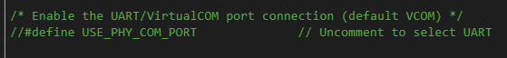

AD4130 IIO Application
====================

Introduction
-----------------

This guide gives an overview of using the ARM platform(s) supported (default is Mbed) 
firmware with Analog Devices AD4130 Evaluation board and SDP-K1 (or other compatible)
MCU controller board. This firmware application leverages the ADI developed IIO 
(Industrial Input Output) ecosystem to evaluate the AD4130 (IIO) device by
providing a device debug and data capture support.

IIO oscilloscope is used as a client application running on PC, which is 
ADI developed GUI for ADC data visualization and device debug. The interface 
used for communicating with client application using the firmware
is UART (Note: SDP-K1 can also support high speed VirtualCOM port @1Mbps or 
higher speed for faster data transmission). The firmware leverages ADI created 
no-os and platform drivers software layers to communicates with IIO device.

.. code-block:: bash
   
   *Note
   This code has been developed and tested on the SDP-K1 Controller Board with Arduino headers. However, same code can 
   be used without or with little modifications on any Mbed enabled board which has Arduino Header support on it, such 
   as STM32-Discovery, STM32-Nucleo, etc.

Useful Links
-----------------

* `Mbed Online Compiler <https://studio.keil.arm.com/auth/login/>`_

* `SDP-K1 on Mbed <https://os.mbed.com/platforms/SDP_K1/>`_

* `AD4130 Product Page <https://www.analog.com/en/products/ad4130-8.html>`_

* `AD4130 Evaluation Kit <https://www.analog.com/en/products/ad4130-8.html#product-evaluationkit>`_

Hardware Connections
-----------------

**Jumper Settings**

* SDP-K1:

Connect the VIO_ADJUST jumper on the SDP-K1 board to 3.3V position to drive SDP-K1 GPIOs at 3.3V

* EVAL-AD4130:

`ad4130_evb_jumper_settings.xlsx <https://github.com/analogdevicesinc/precision-converters-firmware/blob/projects-documentation-update/doc/sphinx/source/images/ad4130_iio/ad4130_evb_jumper_settings.xlsx>`_

.. code-block:: bash
   
   *Note
   Above jumper settings of AD4130 EVB are specific to sensor demo modes supported in the firmware. Change the jumper 
   settings according to your requirements.

AD4130 uses SPI communication for device register access and data capture.

For data transmission to IIO client, *VirtualCOM* Or *UART* serial communication is used. 
Firmware by default uses the VCOM serial interface for higher speed data transmission.

SDP-K1 is powered through USB connections from the computer. SDP-K1 Mbed board acts as a 
serial device when connected to PC, which creates a COM Port to connect to IIO 
oscilloscope GUI running on windows-os. The COM port assigned to a device can be
seen through the device manager for windows-based OS.

SDP-K1 can support high speed VirtualCOM port USB interface, so by default VCOM 
is configured as default interface in the firmware. The interface can be set to 
UART by defining macro **USE_PHY_COM_PORT** in the app_config.h file.

.. code-block:: bash
   
   *Note
   Actual COM port number for your device may not be the same as shown above. Therefore, always check your SDP-K1 serial
   COM port number before connecting to IIO client.

Software Downloads
-----------------

Below section provides an overview about the pre-requisites needed to build and run the project:

* Source code is hosted on `precision-converters-firmware <https://studio.keil.arm.com/auth/login/>`_ repo
* `Build Guide for projects <https://wiki.analog.com/resources/tools-software/product-support-software/pcg-fw-mbed-build-guide>`_
* `Libiio: IIO Library <https://github.com/analogdevicesinc/libiio/releases>`_ 
This library provides an abstracted interface to communicate with IIO device 
and IIO client application (IIO Oscilloscope) without worrying about the low 
level hardware details. Download and install below Libiio windows installer in 
your computer.

* `IIO Oscilloscope (Client) <https://github.com/analogdevicesinc/iio-oscilloscope/releases>`_
This is a GUI (Graphical User Interface) based IIO client application for data 
visualization and device configuration/debugging. The data from IIO devices 
(ADCs/DACs) is transmitted over Serial/Ethernet/USB link to IIO Oscilloscope 
client through the abstracted layer of “libiio”. Download and install below IIO
Oscilloscope windows installer in your computer.

Evaluating AD4130 Using IIO Ecosystem
-----------------

.. code-block:: bash
   
   *Note
   Ensure that hardware connection has been made properly in between Controller Board (SDP-K1) and ADC Eval board. Also 
   ensure all software's (IIO firmware, Libiio windows installer and IIO Oscilloscope windows installer) are downloaded 
   and installed in your computer before trying to communicate with the device.

**Running IIO Oscilloscope (Client)**

Open the IIO Oscilloscope application from start menu and configure the serial (UART) 
settings as shown below. Click on refresh button and AD4130 device should pop-up 
in IIO devices list.

Click 'Connect' and it should by default open the data ‘Capture’ window. You can
drag aside or close this window to see the main ‘Debug and DMM’ tab window.

**Configure/Access Device Attributes (Parameters)**

The IIO Oscilloscope allows user to access and configure different device parameters, 
called as 'Device Attributes“. There are 2 types of attributes:

* Device Attributes (Global): Access/Configure common device parameters.
* Channel Attributes (Specific to channels): Access/Configure channel specific device parameters.

How to read and write attribute:

* To 'Read' an attribute, simply select the attribute from a list or press 'Read' button on left side.
* To 'Write' an attribute, select attribute value in the 'value field' and press 'Write' button.

**Using DMM Tab to Read DC Voltage on Input Channels**

DMM tab can be used read the instantaneous voltage applied on analog input channels. 
Simply select the device and channels to read and press start button.

.. code-block:: bash
   
   *Note
   The voltage is just instantaneous, so it is not possible to get RMS AC voltage or averaged DC voltage. Also, when 
   using DMM tab, do not access/use the Data capture or Debug tab as this could impact data capturing. Both DMM scan and 
   data capture uses different methods of conversion. The DMM data is read using single conversion, while data capture 
   uses continuous conversion mode of operation.

**Data Capture from IIO Device**

To capture the data from AD4130 IIO device, simply select the device and channels
to read/capture data. The data is plotted as “ADC Raw Value” Vs “Number of Samples” 
and is just used for Visualization. The data is read as is from device without 
any processing. If user wants to process the data, it must be done externally 
by capturing data from the Serial link on controller board.

.. code-block:: bash
   
   *Note
   The DMM or Debug tab should not be accessed when capturing data as this would impact data capturing. Both DMM scan 
   and data capture uses different methods of conversion. The DMM data is read using single conversion, while data 
   capture uses continuous conversion mode of operation.

Data capturing utilizes two modes:

* Normal sequencer: 
In this mode, the channel for which data to be captured are 
enabled and automatically added into a sequencer. The sequencer operates in the 
continuous conversion mode. After each conversion, an interrupt signal attached 
to configured INT source is triggered and conversion result is read into a internal
acquisition buffer.

* FIFO mode: 
This mode uses the internal FIFO of device to store the ADC samples. 
The conversion happens in continuous conversion mode and an interrupt signal attached 
to configured INT source is triggered when internal FIFO becomes full (reached to watermark limit). 
The data from FIFO is read periodically when FIFO is made available by device. 
The FIFO is operated in ‘Oldest Save’ mode as there must be enough time provided 
to read the FIFO after it becomes full. If FIFO is operated into streaming mode, 
the previous data could get overwritten before it is being acquired by the firmware.

*Time Domain plot*

.. code-block:: bash
   
   *Note
   Due to low sampling rate (50SPS) for temperature sensor measurement, select 50 or less samples during data capturing 
   for sensor demo mode channels.

.. image:: ../../doc/sphinx/source/images/ad4130_iio/ad4130_iio_osc_time_domain_plot.png
   :width: 600

*Frequency Domain plot*

.. code-block:: bash
   
   *Note
   Max 4096 samples can be selected for plotting frequency domain response due to limited buffer size in the firmware.

Python Environment and Scripts
-----------------

Data capture, sensor measurement, device calibration, etc. can be achieved with 
python based IIO clients, using 'pyadi-iio' library. A possible option using ADI's 
pyadi-iio library in python has been demonstrated in the forthcoming sections. 
The python scripts are provided along with firmware package.

**Setting-up Python Environment**

* Install python into your local machine. The python scripts are developed and executed using python 3.9.0 version, so recommend using version 3.9.0 or beyond. 
* Once python is installed, make sure the environment path (on windows machine) is set properly. You can verify if python is installed properly by typing “python --version” command on command line tool such as gitbash, command prompt, power shell, etc.

* Install the “pyadi-iio” python package by executing command “python -m pip install pyadi-iio”. Detailed guide on installing it is available in `Python Interfaces for ADI Hardware <https://github.com/analogdevicesinc/pyadi-iio>`_

.. code-block:: bash
   
   *Note
   Make sure to install additional support packages by running requirements.txt file using command “python -m pip install
   -r requirements.txt from “scripts/” directory”

**Modifying/running Python Scripts**

* All python scripts specific to the IIO firmware are stored into “scripts” folder present in the project directory. So, any script must be executed from this folder.

Sensor Demo Modes
-----------------

AD4130 IIO firmware provides support for interfacing different sensors to analog 
inputs and perform the measurement on them. Below sensor demo modes are supported in the firmware.

* User Default Config (All channels test)
* 2-wire/3-wire/4-wire RTD (Default is PT100)
* Thermistor (Default is 10K NTC)
* Thermocouple (Default is T type TC and PT1000 RTD as CJC)
* Load Cell (4-wire bridge)
* Noise Test (AIN0-AIN1 shorted)
* ECG
* Power Test (ADC internal channels voltage/current measurement)

.. code-block:: bash
   
   *Note
   The selection of default sensor types can be changed from ‘ad4130_temperature_sensor.cpp’ file to large extent and 
   from respective user config header files to some extent.

**Demo Mode Selection**

The sensor mode selection is done from “app_config.h” file using “ACTIVE_DEMO_MODE_CONFIG” 
macro. The selection is done at compilation time, that means only one sensor demo 
mode is active at a time. Whenever demo mode is changed from app_config.h file, 
the code must be compiled again to generate a new binary file for that.

.. image:: ../../doc/sphinx/source/images/ad4130_iio/ad4130_sensor_demo_selection.png
   :width: 600

**Demo Mode User Configuration**

Firmware maintains the unique user configuration file for each sensor demo mode 
as per below table. The configurations can be updated by using .c and .h user config files.

**Sensor Measurement**

Sensor measurement for RTD, Thermistor, Thermocouple, Noise Test, ECG, Power Test 
and User Default Config can be done using the IIO oscilloscope GUI client application 
or by executing python scripts from the ‘scripts’ folder. Temperature result for RTD, 
TC and Thermistor would be in degree Celsius. The result for other configs would in voltage/current.

Sensor measurement for Load Cell can be done by executing the python script available 
in the project “scripts” folder. IIO oscilloscope can only support measurement for voltage, 
current and temperature quantities and threfore python code is developed to support 
measurement for other sensor types.

The python script can be executed from ‘Visual Studio Code’ or any other preferred 
IDE/console prompt application using “python script_name.py” command as shown below. 
The demo config is fetched from the firmware by establishing serial (UART/VCOM) 
connection between host and MCU (sdp-k1). Refer next section to install necessary
python tools and updating/executing the python scripts.

**Sensor Channels Calibration**

It is possible to calibrate the device channels which are connected to external sensors. 
The sensors calibration (gain and offset) is done by executing the python script “ad4130_calibration.py”.

AD4130 Firmware Structure
-----------------

**app_config.h**

* Select the AD4130 device package (either LFCSP or WLCSP). Default is WLCSP. The corresponding hardware board must be used with software selected package type.
* Select demo config mode (e.g. Thermistor, 2-wire RTD, etc).
* Select data capture mode (Continuous, Burst, FIFO).
* Select UART/VCOM (only for SDP-K1).

**ad4130_user_config.c**

This file defines the user configurations for the AD4130, such as SPI parameters 
(frequency, mode, etc) and other init parameters used by No-OS drivers to initialize 
AD4130 device (e.g. required GPIOs, software/hardware mode, etc). These are the 
parameters loaded into device when device is powered-up or power-cycled.

**ad4130_data_capture.c**

This file implements the data capturing logic for the AD4130 device. The data 
capturing can be done using normal ‘Sequencer’ Or using internal ‘FIFO’. Enable 
the macro ‘FIFO_ENABLED’ for enabling FIFO mode.

**ad4130_iio.c**

This file defines getter/setter functions for all the device and channel specific
attributes (related to AD4130 devices) to read/write the device parameters. The 
majority of device specific functionality is present in this module.

**No-OS Drivers for AD4130**

The no-os drivers provide the high level abstracted layer for digital interface 
of AD4130 devices. The complete digital interface (to access memory map and perform 
data read) is done in integration with platform drivers. The functionality related 
with no-os drivers is covered in below 2 files:

* ad413x.c
* ad413x.h
